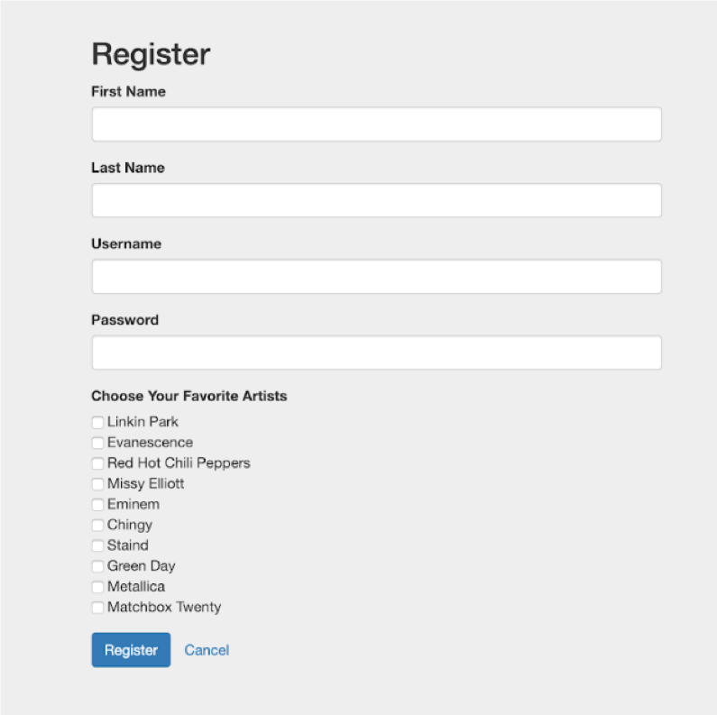
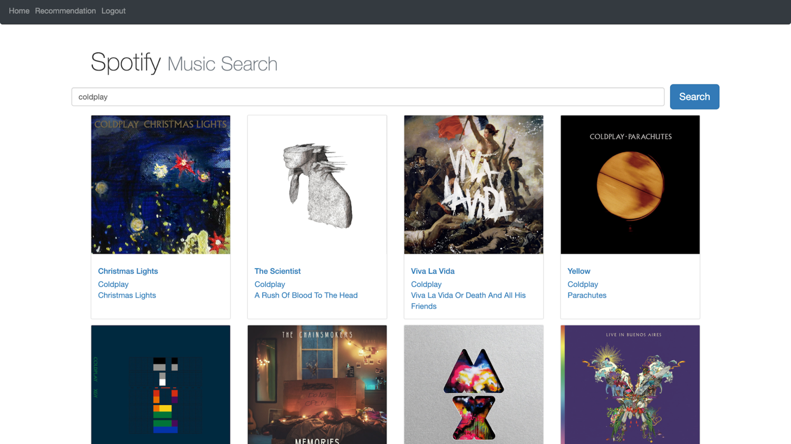
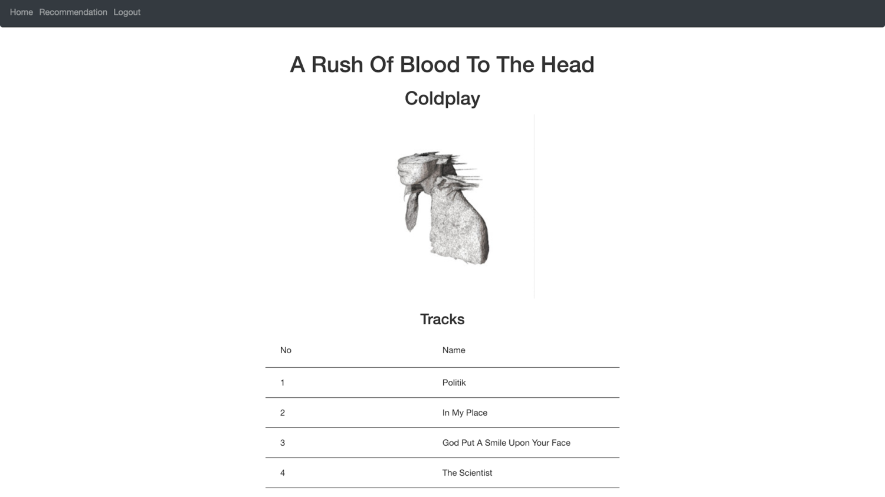
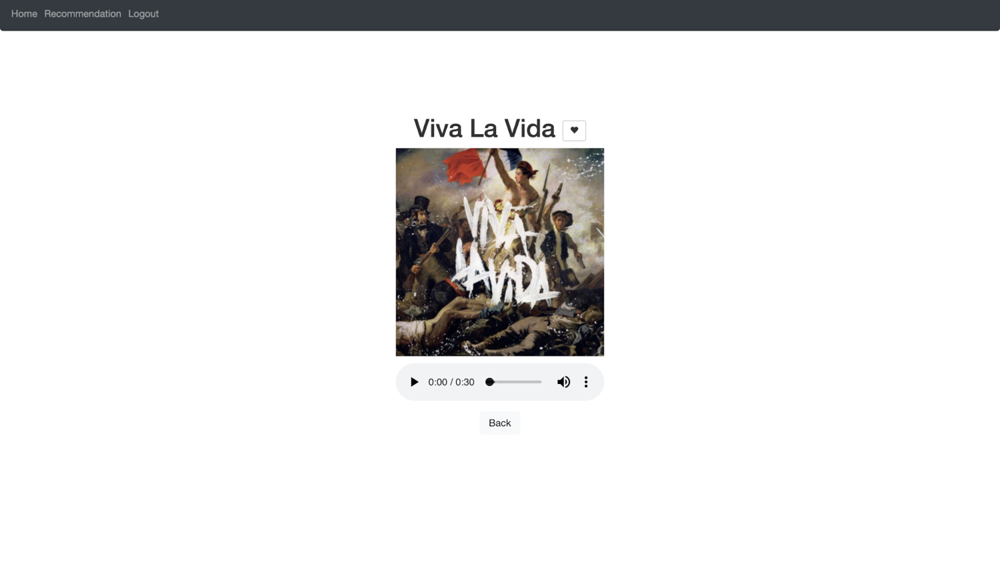
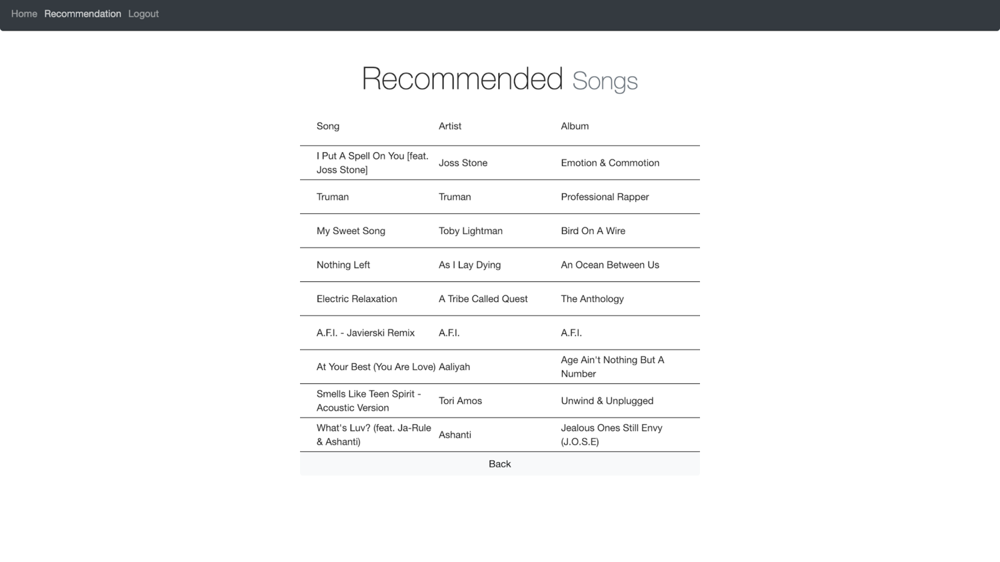

# Angular Music Recommendation System

*	A system provides daily recommended song list, built with tag-based recommendation and collaborative filtering algorithms, solving the problem of sparse matrix and cold start with Python
*	Embedded with dataset of 360k users and 4GB dataset of Yahoo! Music, of overall 80% recommendation accuracy
*	Front end: developed with Angular 7, including patterns of user login and registration, search from Spotify, user’s favorite song list, recommended song list and media player

*   Front end: Angular7
*	Back end: Flask
*   Storage: SQLite, AWS S3

### How to start?
```
npm start
```

### Demo





